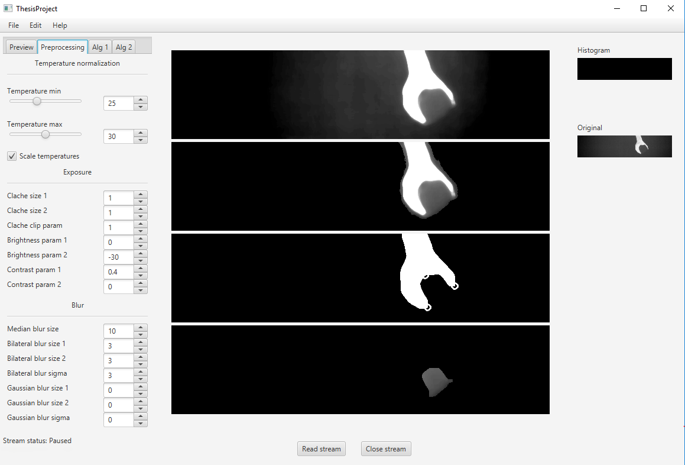

# Detection-of-products-in-hand-by-IR-camera
This repository contains Java sources of the main application with detection and proccesing algorithms 
related to my bachelor thesis (https://github.com/lukasbrchl/Bachelor-thesis-text-sources). 

### Prerequisites
* Java >= 1.8
* OpenCV >= 3.3

### Usage
* Clone the repository
```
git clone https://github.com/lukasbrchl/Detection-of-products-in-hand-by-IR-camera.git
```
* Link OpenCV library with natives
* Rename conf/config-template.properties to conf/config.properties and setup image paths.
* Build and run the app
* Select folder with input images or recieve them from the socket (https://github.com/lukasbrchl/Modified-eBUS-Player can be used as server)
* Run the stream

 

### License

This project is licensed under the MIT License - see the [LICENSE](LICENSE) file for details


